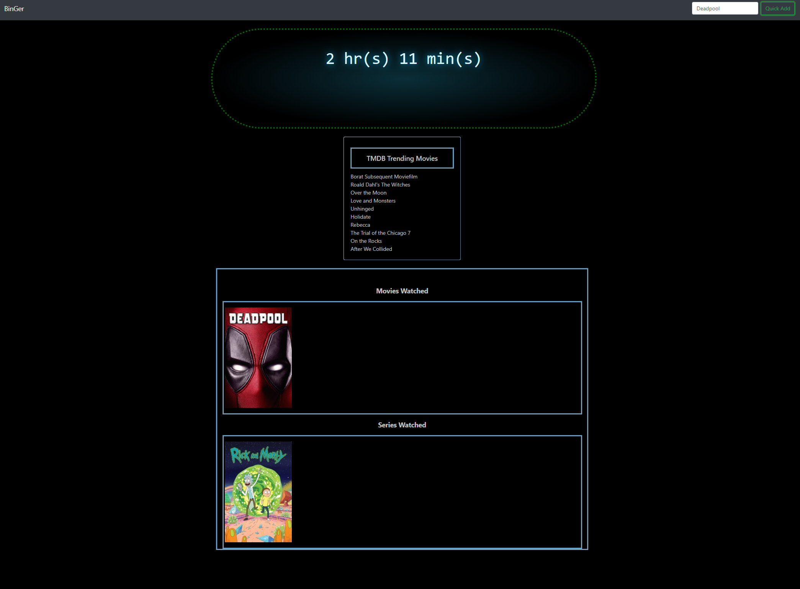

## Group 9 - Project 1
This project is a day planner that allows the user to enter events into each time slot for the work day. The events are stored locally, so that they can be revisited or edited throughout the day.

## Motivation
To create a healthier and more informed user when it comes to their time in front of a TV 

## Build status
Passing

## Code style

 
## Screenshots
</img>

## Tech/framework used
HTML
CSS
Bootstrap
JavaScript
JQuery

## Features
Search movies and tv series, and track time spent watching
Offers suggested viewing based on TMDB trending list

## Code Example

## Installation
N/A

## API Reference
OMDB
TMDB

## Tests
N/A

## How to use?
Search for a movie or tv series, add the movie to see the runtime of the show added to your total watch time

## Contribute

## Credits
Travis Mendenhall
John Dolac
Dustin LaMarr

## License
N/A